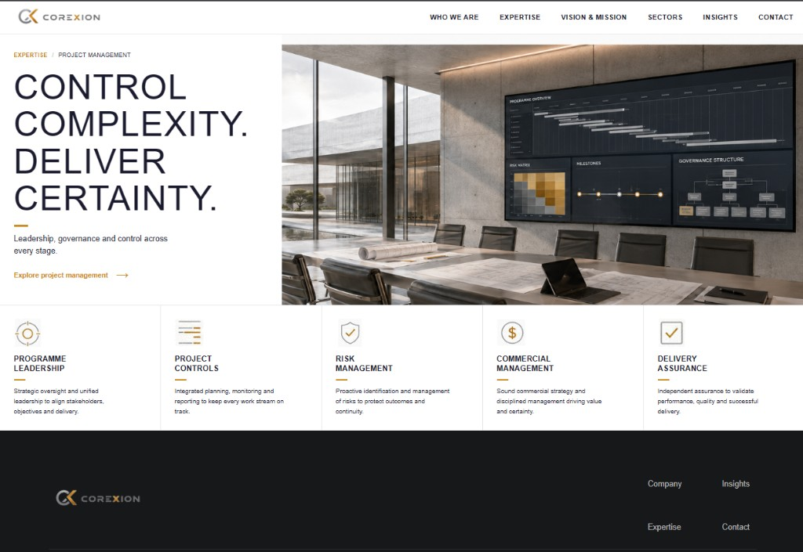
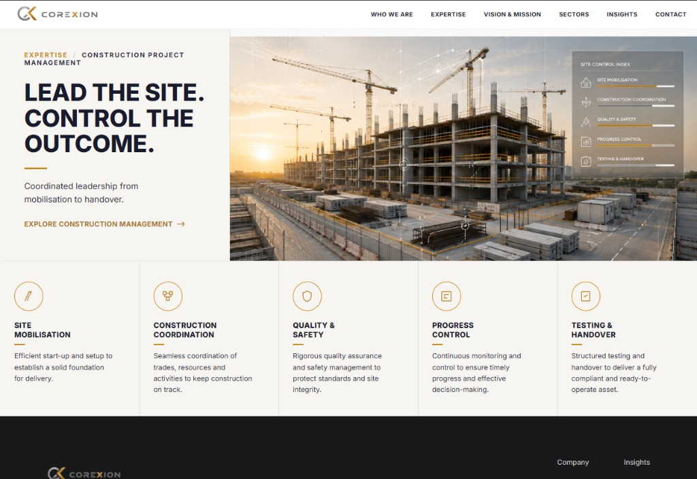

# COREXION

Marketing site for COREXION, served by Django. Pages live as HTML templates in `pages/` and `templates/`. Copy and photos come from PostgreSQL (`PageSection`) and are rendered on the server.

<p align="center">
  
  &nbsp;
  
</p>

## Requirements

- Python 3.12+
- PostgreSQL

## Local setup

```bash
python -m venv .venv
.venv\Scripts\activate          # Windows
# source .venv/bin/activate     # macOS / Linux

pip install -r requirements.txt
copy .env.example .env          # then set POSTGRES_PASSWORD
python manage.py migrate
python manage.py createsuperuser
python manage.py runserver
```

Open http://127.0.0.1:8000/

Do not open the HTML files directly in a browser. They contain Django template tags and only work through the server.

## Configuration

Copy `.env.example` to `.env`. Never commit `.env`.

| Variable | Purpose |
|---|---|
| `POSTGRES_*` | Database connection |
| `DJANGO_SECRET_KEY` | Required when `DJANGO_DEBUG=0` |
| `DJANGO_DEBUG` | `1` locally, `0` in production |
| `DJANGO_ALLOWED_HOSTS` | Comma-separated hostnames |
| `THROTTLE_*` | API rate limits |

## Content

- Edit sections in the private CMS. Each row is `page_slug` + `section_key`.
- Replacing or deleting an image removes the file from disk unless another section still uses it.
- Uploads go to `media/sections/` and are gitignored. Back them up with the database.
- Public pages are listed in `config/pages.py`. Add a line there when you add a page.

## API

`GET /api/sections/?page_slug=home` is still available (read-only, rate limited). The website does not use it; pages are rendered on the server.

## Tests

```bash
python manage.py test content
```

## Deploy on Vercel

1. Import [AttaAhmedDev/COREXION](https://github.com/AttaAhmedDev/COREXION) at [vercel.com/new](https://vercel.com/new). The first deploy can succeed without a database (pages use the static HTML fallbacks).
2. Add **Neon** (Storage) so `DATABASE_URL` is set, restore your local Postgres dump, then redeploy so migrations run.
3. Add **Vercel Blob** so `BLOB_READ_WRITE_TOKEN` is set (CMS photo uploads).
4. Set at least:
   - `DJANGO_SECRET_KEY`
   - `DJANGO_DEBUG=0`
   - `DJANGO_ADMIN_PATH` (your private CMS path)
   - `DJANGO_ALLOWED_HOSTS` (your production host; `.vercel.app` is added automatically)
5. Design files under `/assets/` are collected to the CDN automatically.

Do not rely on `media/sections/` on Vercel — that disk is temporary. Re-upload CMS images once Blob is connected, or keep using the static files already in `assets/`.
